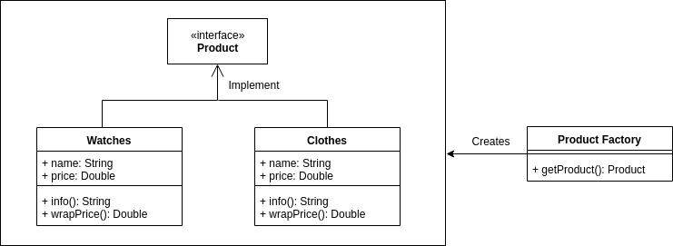

# GiongStore, a design pattern practice project

## Table of contents
1. Creation patterns
    1. [Factory Pattern](###-1.-Factory-pattern)
    2. Abstract factory pattern
    3. Singleton pattern
    4. Builder pattern
    5. Prototype pattern
2. Structural patterns
    1. Adapter pattern
    2. Bridge pattern
    3. Filter pattern
    4. Composite pattern
    5. Decorator pattern
    6. Facade pattern
    7. Flyweight pattern
    8. Proxy pattern
    9. Chain of responsibility
3. Behavior patterns
    1. Command pattern
    2. Interpreter pattern
    3. Iterator pattern
    4. Mediator pattern
    5. Memento pattern
    6. Observer pattern
    7. State pattern
    8. Null Object pattern
    9. Strategy pattern
    10. Template pattern
    11. Visitor pattern
4. References

## Creation patterns
### 1. Factory pattern
  
Intend: dynamically create classes without know how to initialize them. Just know how to use class ProductFactory.     
[Back to table of contents](#table-of-contents)

### 2. Abstract Factory pattern
Class: 

