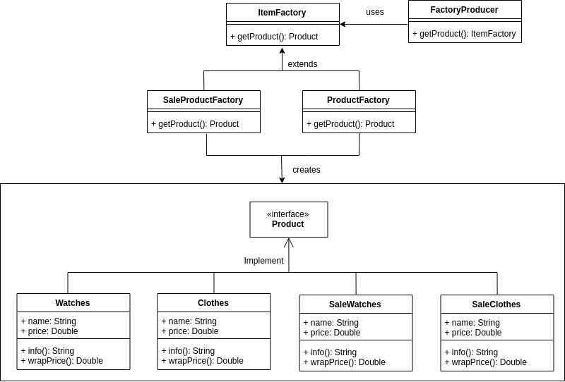

# GiongStore, a design pattern practice project

## Table of contents
1. Creation patterns
    1. [Factory Pattern](#i-factory-pattern)
    2. [Abstract factory pattern](#ii-abstract-factory-pattern)
    3. [Singleton pattern](#iii-singleton-pattern)
    4. [Builder pattern](#iv-builder-pattern)
    5. [Prototype pattern](#v-prototype-pattern)
2. Structural patterns
    1. [Adapter pattern](#i-adapter-pattern)
    2. [Bridge pattern](#ii-bridge-pattern)
    3. [Filter pattern](#iii-filter-pattern)
    4. [Composite pattern](#iv-composite-pattern)
    5. [Decorator pattern](#v-decorator-pattern)
    6. [Facade pattern](#vi-facade-pattern)
    7. [Flyweight pattern](#vii-flyweight-pattern)
    8. [Proxy pattern](#viii-proxy-pattern)
3. Behavior patterns
    1. [Chain of responsibility](#i-chain-of-responsibility-pattern)
    2. Command pattern
    3. Interpreter pattern
    4. Iterator pattern
    5. Mediator pattern
    6. Memento pattern
    7. Observer pattern
    8. State pattern
    9. Null Object pattern
    10. Strategy pattern
    11. Template pattern
    12. Visitor pattern
4. References              

## 1. Creation patterns
### i. Factory pattern
  
- Intent: dynamically create objects without know how to initialize them. Can be easily extend same type of object without duplicate code.  
- SOLID: Single Responsibility Principle, Open/Closed Principle     
[Back to table of contents](#table-of-contents)  

### ii. Abstract Factory pattern
  
- Intent: create multiple factories for differents families of related objects.  
- SOLID: Single Responsibility Principle, Open/Closed Principle  
[Back to table of contents](#table-of-contents)

### iii. Singleton pattern
- Intent: guarantee create only one instance of object.  
- SOLID: no  
[Back to table of contents](#table-of-contents)  

### iv. Builder pattern
- Intent: build a complex object step by step.  
- SOLID: Single Responsibility Principle  
[Back to table of contents](#table-of-contents)  

### v. Prototype pattern
- Intent: provide clone method inside class for easy to create object without calling constructor.   
- SOLID:  
[Back to table of contents](#table-of-contents)  

## 2. Structural patterns
### i. Adapter pattern
Intent: create an adapter between two classes.  
SOLID: Single Responsibility Principle, Open/Closed Principle  
[Back to table of contents](#table-of-contents)  

### ii. Bridge pattern
Intent: split abstraction and implementation for developing independently.  
SOLID: Single Responsibility Principle, Open/Closed Principle  
[Back to table of contents](#table-of-contents)  

### iii. Filter pattern
Intent: create an filter logic which can be chained to adapt complex logic.  
SOLID: Single Responsibility Principle, Open/Closed Principle  
[Back to table of contents](#table-of-contents)  

### iv. Composite pattern
Intent: create an complex object which has hierarchial structure.  
SOLID:  
[Back to table of contents](#table-of-contents)  

### v. Decorator pattern
Intent: adding new logic without alter original class.  
SOLID: Open/Closed Principle  
[Back to table of contents](#table-of-contents)  

### vi. Facade pattern
Intent: provide an interface to hide the complexity of the system.  
SOLID:  
[Back to table of contents](#table-of-contents)  

### vii. Flyweight pattern
Intent: group common attributes into a class and reuse it to decrease memory for create object.   
SOLID:  
[Back to table of contents](#table-of-contents)  

### viii. Proxy pattern
Intent: provide an proxy class to control access to original class.  
SOLID:  
[Back to table of contents](#table-of-contents)

## 3. Behaviour patterns  

## 4. References
1. [Design Patterns in Java by Tutorialspoint](https://www.tutorialspoint.com/design_pattern/index.htm)
2. [Design Patterns by Refactoring.guru](https://refactoring.guru/design-patterns)
3. [Design Patterns: Elements of Reusable Object-Oriented Software by Gang of Four](http://www.grch.com.ar/docs/unlu.poo/Gamma-DesignPatternsIntro.pdf)  